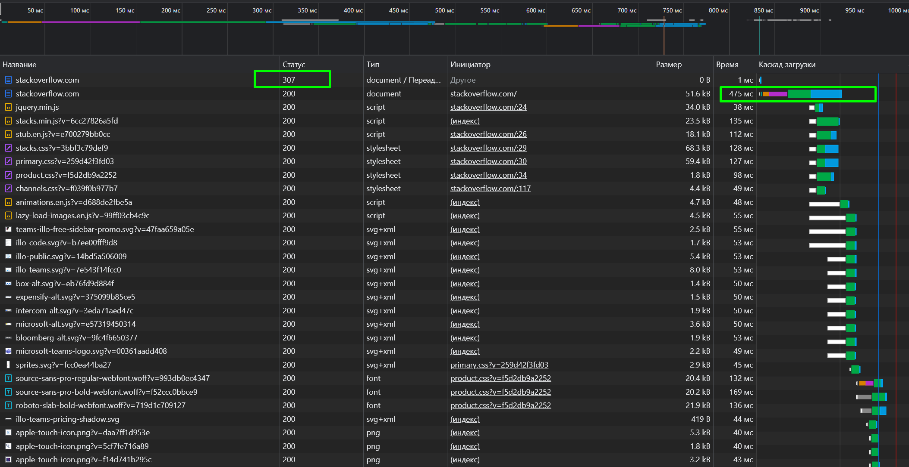

devops-netology 
### Домашнее задание к занятию «3.6. Компьютерные сети, лекция 1»  

#### 1. Работа c HTTP через телнет.
    vagrant@vagrant:~$ telnet stackoverflow.com 80
    Trying 151.101.65.69...
    Connected to stackoverflow.com.
    Escape character is '^]'.
    GET /questions HTTP/1.0
    HOST: stackoverflow.com
    
    HTTP/1.1 301 Moved Permanently
    cache-control: no-cache, no-store, must-revalidate
    location: https://stackoverflow.com/questions
Статус `301 Moved Permanently` - страница перемещена. Это редирект на `HTTPS`.

#### 2. Повторите задание 1 в браузере, используя консоль разработчика `F12`.


    URL запроса: http://stackoverflow.com/questions
    Метод запроса: GET
    Код статуса: 307 Internal Redirect
    Правило для URL перехода: strict-origin-when-cross-origin
Из-за использования `HSTS` _браузер_ сразу переходит на `HTTPS`, поэтому статус `307 Internal Redirect`.  
Дольше всего загружается основное тело документа `https://stackoverflow.com/` (аналогично для `/questions`).

#### 3. Какой IP адрес у вас в интернете?
`156.146.59.22` (подключил какой-то VPN в браузере)

#### 4. Какому провайдеру принадлежит ваш IP адрес? Какой автономной системе AS?
    vagrant@vagrant:~$ whois 156.146.59.22
    Found a referral to whois.ripe.net.
    % Information related to '156.146.58.0 - 156.146.59.255'
    route:          156.146.58.0/23
    origin:         AS60068
    descr:          CDN77 NYC
    mnt-by:         DATACAMP-MNT
    created:        2020-07-03T07:41:10Z
    last-modified:  2020-07-03T07:41:10Z
    source:         RIPE
В роли провайдера, видимо, выступает [CDN77](https://www.cdn77.com/). Автономная система `AS60068`.

#### 5. Через какие сети проходит пакет, отправленный с вашего компьютера на адрес 8.8.8.8? Через какие AS?
    vagrant@vagrant:~$ sudo traceroute -AnI 8.8.8.8
    traceroute to 8.8.8.8 (8.8.8.8), 30 hops max, 60 byte packets
     1  10.0.2.2 [*]  0.172 ms  0.119 ms  0.117 ms
     2  192.168.1.254 [*]  3.526 ms  3.474 ms  3.329 ms
     3  95.165.128.1 [AS25513]  8.231 ms  8.075 ms  7.934 ms
     4  212.188.1.6 [AS8359]  6.895 ms  6.761 ms  6.628 ms
     5  * * *
     6  * * *
     7  212.188.54.213 [AS8359]  8.298 ms  6.674 ms  6.943 ms
     8  72.14.211.222 [AS15169]  8.927 ms  10.571 ms  10.433 ms
     9  216.239.49.19 [AS15169]  10.277 ms  10.133 ms  10.983 ms
    10  108.170.250.113 [AS15169]  13.514 ms  8.338 ms  8.190 ms
    11  142.251.237.154 [AS15169]  25.782 ms  25.647 ms  25.514 ms
    12  142.251.237.148 [AS15169]  26.406 ms  26.276 ms  27.131 ms
    13  216.239.40.61 [AS15169]  27.012 ms  26.684 ms  26.728 ms
    14  * * *
    15  * * *
    16  * * *
    17  * * *
    18  * * *
    19  * * *
    20  * * *
    21  * * *
    22  * * *
    23  8.8.8.8 [AS15169]  24.907 ms  24.522 ms  24.275 ms
`AS25513` PJSC Moscow city telephone network `AS8359` MTS PJSC `AS15169` Google LLC

#### 6. Повторите задание 5 в утилите `mtr`. На каком участке наибольшая задержка - `delay`?
```  
vagrant@vagrant:~$ mtr -rny 0 8.8.8.8
Start: 2022-06-30T11:25:27+0000
HOST: vagrant                     Loss%   Snt   Last   Avg  Best  Wrst StDev
  1. AS???    10.0.2.2             0.0%    10    0.4   0.4   0.3   0.7   0.1
  2. AS???    192.168.1.254        0.0%    10    5.4   4.4   3.5   6.1   1.0
  3. AS25513  95.165.128.1         0.0%    10    7.1  10.0   4.5  32.5   8.2
  4. AS8359   212.188.1.6          0.0%    10    7.2   6.3   4.0   7.8   1.1
  5. AS8359   212.188.1.5         80.0%    10    6.8   7.1   6.8   7.3   0.3
  6. AS8359   195.34.53.206       90.0%    10    9.0   9.0   9.0   9.0   0.0
  7. AS8359   212.188.54.213       0.0%    10    9.2  13.1   7.5  51.0  13.4
  8. AS15169  72.14.211.222        0.0%    10    8.1   9.8   8.0  19.4   3.4
  9. AS15169  216.239.49.19        0.0%    10    8.9   8.0   6.5   9.9   1.1
 10. AS15169  108.170.250.113     40.0%    10    7.8  12.5   6.4  37.3  12.1
 11. AS15169  142.251.237.154     30.0%    10   30.4  24.4  22.6  30.4   2.9
 12. AS15169  142.251.237.148      0.0%    10   26.1  26.9  24.9  32.3   2.0
 13. AS15169  216.239.40.61        0.0%    10   22.7  24.0  22.7  26.3   1.2
 14. AS???    ???                 100.0    10    0.0   0.0   0.0   0.0   0.0
 15. AS???    ???                 100.0    10    0.0   0.0   0.0   0.0   0.0
 16. AS???    ???                 100.0    10    0.0   0.0   0.0   0.0   0.0
 17. AS???    ???                 100.0    10    0.0   0.0   0.0   0.0   0.0
 18. AS???    ???                 100.0    10    0.0   0.0   0.0   0.0   0.0
 19. AS???    ???                 100.0    10    0.0   0.0   0.0   0.0   0.0
 20. AS???    ???                 100.0    10    0.0   0.0   0.0   0.0   0.0
 21. AS???    ???                 100.0    10    0.0   0.0   0.0   0.0   0.0
 22. AS???    ???                 100.0    10    0.0   0.0   0.0   0.0   0.0
 23. AS15169  8.8.8.8              0.0%    10   23.7  24.3  23.3  25.8   0.8
 ```
Худшее среднее значение задержки (Avg) у `12. AS15169 142.251.237.148`. 

#### 7. Какие DNS сервера отвечают за доменное имя `dns.google`? Какие `A` записи?
    vagrant@vagrant:~$ dig +short NS dns.google
    ns1.zdns.google.
    ns4.zdns.google.
    ns3.zdns.google.
    ns2.zdns.google.
    vagrant@vagrant:~$ dig +short A dns.google
    8.8.4.4
    8.8.8.8

#### 8. Проверьте PTR записи для IP адресов из задания 7. Какое доменное имя привязано к IP?
    vagrant@vagrant:~$ dig +short -x 8.8.8.8
    dns.google.
    vagrant@vagrant:~$ dig +short -x 8.8.4.4
    dns.google.
