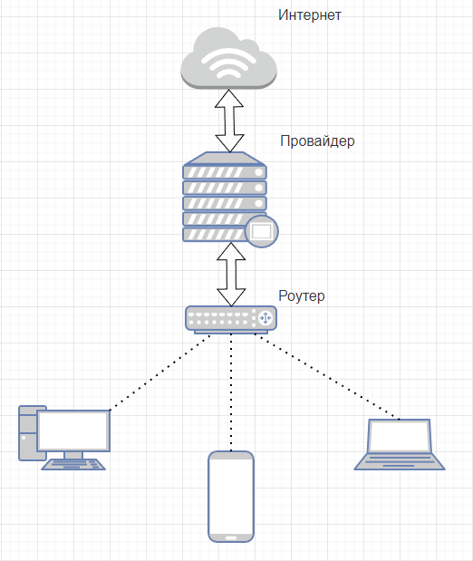

devops-netology 
### Домашнее задание к занятию «3.8. Компьютерные сети, лекция 3»  

#### 1. Подключитесь к публичному маршрутизатору в интернет. Найдите маршрут к вашему публичному IP
    route-views>show ip route 95.165.x.x
    Routing entry for 95.165.0.0/16
      Known via "bgp 6447", distance 20, metric 0
      Tag 2497, type external
      Last update from 202.232.0.2 7w0d ago
      Routing Descriptor Blocks:
      * 202.232.0.2, from 202.232.0.2, 7w0d ago
          Route metric is 0, traffic share count is 1
          AS Hops 3
          Route tag 2497
          MPLS label: none
#### 2. Создайте dummy0 интерфейс в Ubuntu. Добавьте несколько статических маршрутов. Проверьте таблицу маршрутизации.
    vagrant@vagrant:~$ sudo apt install network-manager
    vagrant@vagrant:~$ sudo nmcli con add type dummy ifname dummy0 ipv4.method manual ipv4.addresses 192.0.2.1/24 ipv6.method disabled
    vagrant@vagrant:~$ nmcli con show
    NAME          UUID                                  TYPE   DEVICE
    dummy-dummy0  c38ce30e-22ee-4061-924b-60a809ca3cf9  dummy  --
    vagrant@vagrant:~$ sudo nmcli con modify dummy-dummy0 +ipv4.routes "192.0.2.0/24 192.0.2.1"
#### 3. Проверьте открытые TCP порты в Ubuntu, какие протоколы и приложения используют эти порты? Приведите несколько примеров.
    vagrant@vagrant:~$ ss -ta
    State           Recv-Q          Send-Q                   Local Address:Port
    LISTEN          0               4096                         127.0.0.1:8125
    LISTEN          0               4096                           0.0.0.0:19999
    LISTEN          0               4096                     127.0.0.53%lo:domain
    LISTEN          0               128                            0.0.0.0:ssh
    LISTEN          0               244                          127.0.0.1:postgresql
    ESTAB           0               0                            10.0.2.15:ssh
    LISTEN          0               4096                                 *:9100
    LISTEN          0               128                               [::]:ssh
#### 4. Проверьте используемые UDP сокеты в Ubuntu, какие протоколы и приложения используют эти порты?
    vagrant@vagrant:~$ sudo ss -upa
    State              Recv-Q             Send-Q                          Local Address:Port
    ESTAB              0                  0                                   127.0.0.1:36201
    users:(("postgres",pid=2042,fd=7), ...
    UNCONN             0                  0                                   127.0.0.1:8125
    users:(("netdata",pid=885,fd=35))
    UNCONN             0                  0                               127.0.0.53%lo:domain
    users:(("systemd-resolve",pid=852,fd=12))
    UNCONN             0                  0                              10.0.2.15%eth0:bootpc             
    users:(("systemd-network",pid=850,fd=19))
#### 5. Используя diagrams.net, создайте L3 диаграмму вашей домашней сети или любой другой сети, с которой вы работали.
Попробовал diagrams.net, правильная L3 диаграмма - отдельная тема для исследования.  
